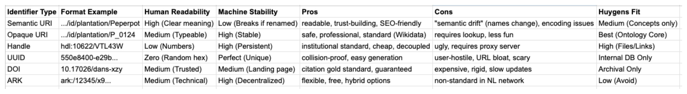

# Linked Open Data: Notes

> Trying to understand what linked data is, why it might matter for this project, and whether we should actually do it.

---

## What is it about

"Linked Open Data" (LOD) is a way of publishing data so that it can connect to other data on the web. The basic idea:

1. Use URIs (web addresses) to identify things
2. When someone looks up a URI, return useful information
3. Include links to other URIs

So instead of my database having a field `birthplace = "Paramaribo"`, it would have `birthplace = https://www.wikidata.org/entity/Q3001`. Anyone who knows what Wikidata is can follow that link and get more information about Paramaribo.

Tim Berners-Lee (inventor of the web and linked data initiator) proposed a "five star" rating (https://5stardata.info/en/):

| Stars | What It Means                            |
| ----- | ---------------------------------------- |
| 1     | Available on the web, any format (PDF)   |
| 2     | Structured data, but proprietary (Excel) |
| 3     | Open format (CSV)                        |
| 4     | Use URIs for things                      |
| 5     | Link to other data or projects           |

Right now the Suriname Time Machine data is maybe 3-star (structured CSVs) with some having links to WikiMedia.

---

## Why do we need it

- Interoperability: other projects could use our data without custom parsing
- Enrichment: following links to Wikidata gets us coordinates, alternate names, related entities
- Standards: using CIDOC-CRM vocabulary means cultural heritage scholars understand our schema
- Discoverability: linked data crawlers could find and index our project (which could also be problematic, so we probably also need to add a bit of a barrier for that)

---

## URIs and Identifiers

Every entity should have a URI. Something like:

```
https://surinametijdmachine.org/person/PERS_0001
https://surinametijdmachine.org/place/LOC_0042
https://surinametijdmachine.org/map/MAP_1763_001
```

If someone requests that URI, they should get information about the entity. In different formats depending on what they ask for:

- Web browser → HTML page
- Machine → JSON-LD or RDF

Different URI types with examples and a pro and con list


---

## RDF

RDF (Resource Description Framework) represents everything as triples: subject - predicate - object, example:

```
<PERS_0001> <hasName> "Jan Klaas"
<PERS_0001> <wasBornIn> <LOC_0042>
<LOC_0042> <label> "Paramaribo"
```

Great to use, because:

- You can merge data from different sources (if they use the same predicates)
- Queries can follow chains of relationships
- There's no fixed schema (both good and bad)

BDifficult to use, because:

- Simple things become verbose
- Querying requires learning SPARQL
- Most tools expect tables, not triples

---

## JSON-LD

JSON-LD is RDF in JSON clothing. It looks like normal JSON:

```json
{
  "@context": "https://schema.org/",
  "@type": "Person",
  "@id": "https://example.org/person/PERS_0001",
  "name": "Jan Klaas",
  "birthPlace": {
    "@id": "https://example.org/place/LOC_0042",
    "name": "Paramaribo"
  }
}
```

The `@context` says "interpret `name` as `schema.org/name`" and so on. Under the hood, it's RDF triples.

This is probably the export format we should use. It is readable by both humans and machines, and also necessaryreunions.org is using it, and the HTR annotations of the maps are already structured in a JSON way, and AnnoRepo is using it, and it is easy to manipulate and track the changes.

---

## Vocabularies

**Schema.org** - General purpose. Person, Place, Event. Used by Google for search results.
**Dublin Core** - Metadata standard. Title, creator, date, description. Good for documents.
**FOAF** (Friend of a Friend) - People and relationships. A bit dated but still used.
**CIDOC-CRM** - Cultural heritage. Very comprehensive but complex. See [cidoc-crm.md](./cidoc-crm.md).
**GeoSPARQL** - Geospatial data. Would be relevant for our maps.
**PROV-O** - Provenance. Who created what, when, based on what. Important for us.

---

## Wikidata

Wikidata is the most useful external dataset for us. It has:

- Surinamese places with coordinates
- Historical figures (some plantation owners, colonial administrators)
- Stable identifiers (Q-numbers)
- Multilingual labels

Example: Paramaribo is Q3001. Query Wikidata for its coordinates, population, administrative divisions, etc.

**Practical approach:** Store Wikidata Q-IDs alongside our own identifiers. When we export to linked data, use `owl:sameAs` to say "our LOC_0042 is the same as Wikidata Q3001."

```json
{
  "@id": "https://example.org/place/LOC_0042",
  "owl:sameAs": "http://www.wikidata.org/entity/Q3001"
}
```

---

## The Provenance Problem

One thing LOD standards do well: provenance. PROV-O lets you say:

- This assertion was generated by this activity
- Which was carried out by this person
- At this time
- Based on this source

```turtle
<interpretation-001> a prov:Entity ;
    prov:wasGeneratedBy <transcription-activity> ;
    prov:wasAttributedTo <researcher-orcid> ;
    prov:wasDerivedFrom <source-document> ;
    prov:generatedAtTime "2025-01-06T12:00:00Z" .
```

This is exactly what we need for tracking interpretations. The [ethical framework](./ethical-framework.md) says every interpretation should be attributed. PROV-O gives us a standard way to do that.

> Maybe I should model our interpretation table with PROV-O in mind?
