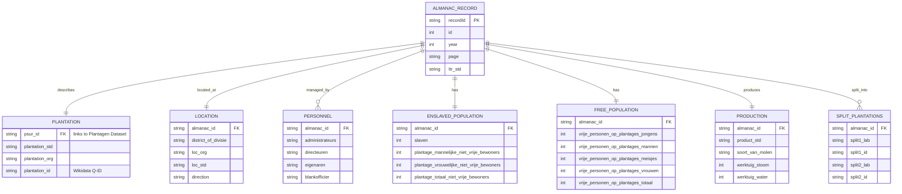

# Plantations Surinaamse Almanakken

> **Version:** V1  
> **Citation:** [@vanOort2023-almanakken]  
> **License:** CC BY-SA 4.0  
> **DOI:** [10.17026/SS/MVOJY5](https://hdl.handle.net/10622/SS/MVOJY5)

---

## Dataset Overview

| Property                | Value                                 |
| ----------------------- | ------------------------------------- |
| **Primary Entity**      | Plantation records (annual snapshots) |
| **Time Coverage**       | 1819–1935                             |
| **Data Rows**           | 22,000                                |
| **Data Columns**        | 60+                                   |
| **File Format**         | CSV                                   |
| **Geographic Coverage** | Suriname (all plantation districts)   |

### Purpose

This dataset contains digitized data from the **Surinaamse Almanakken** (Suriname Almanacs), which were annual publications listing plantations with detailed information about:

- Plantation identification and location
- Geographic/administrative information (districts, located at river/road)
- From 1834 onwards: Enslaved population statistics (by gender, work status)
- From 1856 onwards: Free persons on plantations
- Production information (products, machinery)
- Owners and managers (administrators, directors, owners)
- Temporal references to multiple data points per year
- Provenance: edition and page of Almanak
- Remarks about (other) uses of the plantations, such as churches, medical posts, military posts, etc.

The dataset further contains:

- Links to wikidata via Q-id
- References to Q-ids to related plantations (part of, has parts, owns)

### Notes

Version 2.0 is almost finished, with corrections or errors and some minor improvements such as standardisations of the number of enslaved persons per plantation.

---

## Field Definitions

Based on the source documentation screenshot:

### Identification and Location Fields

| Field                 | Type        | Description                              | Example                                   | Crucial for Linking | Primary Information |
| --------------------- | ----------- | ---------------------------------------- | ----------------------------------------- | ------------------- | ------------------- |
| `recordId`            | text/string | Record identifier                        |                      1856-100-101-304 [year - page in orig source - old record id]                     |         not crucial but useful identifier on the record level (for instance to provide provenance information)            |                     |
| `id`                  | integer     | Integer ID                               |                  21121                         |        No. meaningless former unique record id             |                     |
| `year`                | integer     | Year of almanac entry                    | `1819`, `1827`, `1835`                    |        Important if linking information from a specific year.           |          Yes           |
| `page`                | text/string | Page number or range                     | `e.g., '28', '176-177'`                   |          Important for provenance. At the moment dbnl does not provide IIIF but perhaps in the future we can use the page information to link to the scan           |         Useful to mention provenance            |
| `Itr_std`             | text/string | Letter-index                             | `e.g., 'D', 'D', 'E'`                     |       No              |       No, this refers to the district. this information needs to be further normalised              |
| `district_of_divisie` | text/string | Division name                            |                    Divisie Boven-Commewijne                      |          No, needs to be normalised. Then it can be linked to a future dataset of historical districts of Suriname           |           It is useful illustrative information          |
| `loc_org`             | text/string | Original location description (in Dutch) |                Rivier Commewijne (boven), regterhand in het afvaren                           |         No            |        No             |
| `loc_std`             | text/string | Standardized location name               |            Boven-Commewijne                               |          Not crucial but location is an important attribute           |          Yes           |
| `direction`           | text/string | Direction                                | `rechts`, `links`, `links afvarend`, etc. |          No           |          No, it is illustrative but not necessary           |

### Plantation Information

| Field            | Type        | Description                                                    | Notes                      | Crucial for Linking | Primary Information |
| ---------------- | ----------- | -------------------------------------------------------------- | -------------------------- | ------------------- | ------------------- |
| `plantation_std` | text/string | Standardized plantation name (similar to wikidata label)                                  |         Tygerhol                   |          No           |         Yes            |
| `plantation_org` | text/string | Original plantation name as written in source |        Tijgershol                    |           No          |        No             |           
| `plantation_id`  | text/string | Wikidata Q-identifier                                          |                            |           Yes -- until we have our own permanent ids, this is the unique identifier used to distinguish between plantations; also used to link to wikidata  (and wikipedia) of course            |        Not primary information as such but it is useful to show the unique id           |
| `psur_id`        | text/string | PSUR identifier (e.g., `PSUROOO1`)                             | Links to Slave registers Plantation Dataset |         Yes -- to link to the Slave registers. Note there is some complexity here: in the Almanak dataset a plantation can be split or be a fusion of more plantations (see: split/part of colunmns). The PSUR id will only link to one of these instances. So when linking with PSUR it is best to also include those!           |        Can be useful to explicitly show the id but not crucial             |

### Split Plantations

For plantations split with Q-identifier — Wikidata:

| Field        | Type        | Description              | Crucial for Linking | Primary Information |
| ------------ | ----------- | ------------------------ | ------------------- | ------------------- |
| `split1_lab` | text/string | Split plantation 1 label: the label (name) of a plantation that has been merged with another plantation into a larger combination |        Yes, at least the ID can be crucial if linking to other plantation dataset such as the Slave registers because the link can be to a plantation that has been split or merged. Note that in the new version of the dataset the name of the fields has been changed to "has_parts1_id",  "has_parts1_label", etc               |        Yes, this is valuable information to include (goes for all the other fields in this section)             |
| `split1_id`  | text/string | Split plantation 1 ID : the Q-id of this plantation   |          Yes           |          useful to show the id (and include link to the wikidata item)          |
| `split2_lab` | text/string | Split plantation 2 label |         Idem            |          Idem           |
| `split2_id`  | text/string | Split plantation 2 ID    |                     |                     |
| `split3_lab` | text/string | Split plantation 3 label |                     |                     |
| `split3_id`  | text/string | Split plantation 3 ID    |                     |                     |
| `split4_lab` | text/string | Split plantation 4 label |                     |                     |
| `split4_id`  | text/string | Split plantation 4 ID    |                     |                     |
| `split5_lab` | text/string | Split plantation 5 label |                     |                     |
| `split5_id`  | text/string | Split plantation 5 ID    |                     |                     |

### References and Location Relationships

| Field               | Type        | Description              | Crucial for Linking | Primary Information |
| ------------------- | ----------- | ------------------------ | ------------------- | ------------------- |
| `partof_lab`        | text/string | Part of (label). The inverse of the part_of label: this indicates that a certain plantages has been or has later become part of a larger merged combination of several plantations          |        Yes, see previous section             |         Yes, see previous section            |
| `part_of_id`        | text/string | Part of (ID)             |         Yes            |         useful to show the id (and include link to the wikidata item)            |
| `reference_org`     | text/string | Reference original: this is the literal text from the source   |        No             |        No             |
| `reference_std_lab` | text/string | Reference standardised label: this is the label (wikidata name) of a plantation that owns the plantation mentioned in this record |          Yes for the same reason as the part_of/has_parts references, if there is no direct link between the plantation (id) in this record and the PSUR dataset, there might be a link with the plantation that is the owner of the plantation in this record.            |         Yes           |
| `reference_std_id`  | text/string | Reference standard ID    |         Yes            |       useful to show the id (and include link to the wikidata item)              |

### Plantation Characteristics

| Field             | Type        | Description                     | Crucial for Linking | Primary Information |
| ----------------- | ----------- | ------------------------------- | ------------------- | ------------------- |
| `size_std`        | integer     | Size (standardized) expressed in akkers (acres)             |        No (although it can help in disambiguating between plantations with similar names but different sizes)             |         Not crucial but useful to show this information -- it can (and often does) change over time, so this has to be taken into account when deciding to show this info. For instance, show the size with between brackets the span of years, or just show the minimum and maximum and the years for which we have data            |
| `product_std`     | text/string | Product type: this has been normalised                   |         No (but same argument as above with size)            |        Idem: see on size above             |
| `function`        | text/string | Function/purpose: this includes brief info that is sometime given on functions, e.g. as medical post, church, etc. In Dutch.                |         No            |        Not crucial but interesting to include             |
| `additional_info` | text/string | Additional information. This is more detailed additional information about the use of the plantation and/or info about the (enslaved) workforce          |         No            |       Interesting to include, not crucial              |
| `deserted`        | text/string | Whether plantation was deserted |         No            |          Useful information           |
| `nummer`          | integer     | Number : this is a plotnumber mentioned in the original source.                         |          No           |          No.           |

### Person names: owners and managers

| Field                         | Type        | Description                | Crucial for Linking | Primary Information |
| ----------------------------- | ----------- | -------------------------- | ------------------- | ------------------- |
| `administrateurs`             | text/string | Administrators' names. Administrators were the managers of the plantation from distance (Paramaribo or Europe).      |       Not yet. Once we have normalised all names, we will be able to link them to other person observations. But it this phase this is not yet feasible. Goes for the other person name fields as well. Currently working on a normalisation of all names in this section, so in the future this will open new opportunities for linking.              |         Yes, this is important information for users            |
| `directeuren`                 | text/string | Directors' : these are the actual plantation managers on sitenames           |           Idem          |        Idem             |
| `eigenaren`                   | text/string | Owners' names. These can be natural persons or legal entities (such as organisations, banks, legal representatives, heirs)              |                     |                     |
| `administrateurs_in_Europa`   | text/string | Administrators in Europe. In the later Almanakken, this distinction is made   |                     |                     |
| `administrateurs_in_Suriname` | text/string | Administrators in Suriname |                     |                     |
| `blankofficier`               | text/string | BlankOfficier names: these were the overseers, second in rank to the director. Only listed in the 1835 edition              |                     |                     |

### Enslaved Population

Note: in the 2.0 version 2 new columns have been added:

1) slaves_norm: this column contains a normalised number (integer) that corresponds to the total number of enslaved registered to this plantation.

2) slaves_shared_with: this column contains a wikidata ID of a plantation that shares the enslaved workforce with the plantation in this record. So in practice this would probably mean the plantations are merged but this is not always made explicit in the data.

| Field                                      | Type        | Description                           | Crucial for Linking | Primary Information |
| ------------------------------------------ | ----------- | ------------------------------------- | ------------------- | ------------------- |
| `slaven`                                   | integer     | Number of enslaved people. In the 2.0 version the column is renamed 'slaves_orig' and it contains the original entry from the source, which has been normalised in the new 'slaves_norm' column              |         No            |         Yes, valuable information and at a certain point we will want to compare this number to the amount mentioned in the Slave registers, because often there are discrepancies            |
| `namen_totaalafgemaakten`                  | text/string | The Sranantongo name for the plantation, this column is renamed in the 2.0 version to: 'sranantongo_naam'.  |          No           |          Yes, this is important to include, somewhere in a prominent place. We only have this for the last 3 years          |
| `plantage_mannelijke_niet_vrije_bewoners`  | integer     | Male unfree plantation residents. The following population statistics are only available in the most recent editions. It shows the legal distinction between people owned by plantations or by private owners     |          No           |        Valuable to include (including period)             |
| `plantage_totaal_niet_vrije_bewoners`      | integer     | Total unfree plantation-owned residents     |       Idem, etc              |        Idem, etc             |
| `plantage_vrouwelijke_niet_vrije_bewoners` | integer     | Female unfree plantation-owned residents    |                     |                     |
| `priv_mannelijk_niet_vrije_bewoners`       | integer     | Male privately owned unfree residents         |                     |                     |
| `priv_totaal_niet_vrije_bewoners`          | integer     | Total privately owned unfree residents        |                     |                     |
| `priv_vrouwelijk_niet_vrije_bewoners`      | integer     | Female privately owned unfree residents       |                     |                     |

### More Population Statistics

| Field                                                        | Type    | Description                           | Crucial for Linking | Primary Information |
| ------------------------------------------------------------ | ------- | ------------------------------------- | ------------------- | ------------------- |
| `totaal_generaal_bewoners`                                   | integer | Total general population: all residents, free and unfree              |          Idem, etc           |     Idem, etc               |
| `vrije_bewoners`                                             | integer | Free residents                        |                     |                     |
| `generaal_totaal_slaven`                                     | integer | General total enslaved residents               |                     |                     |
| `generaal_aant_slaven_geschikt_tot_werken_plantages`         | integer | Enslaved fit for work, plantation-owned      |                     |                     |
| `generaal_aant_slaven_geschikt_tot_werken_priv`              | integer | Enslaved fit for work, privately owned         |                     |                     |
| `generaal_aant_slaven_ongeschikt_tot_werken_plantages`       | integer | Enslaved unfit for work, plantation owned    |                     |                     |
| `generaal_aant_slaven_ongeschikt_tot_werken_priv`            | integer | Enslaved unfit for work, privately owned       |                     |                     |
| `totaal_slaven_op_de_plantages_aanwezig_geschikt_tot_werk`   | integer | Total enslaved present fit for work   |                     |                     |
| `totaal_slaven_op_de_plantages_aanwezig_ongeschikt_tot_werk` | integer | Total enslaved present unfit for work |                     |                     |

### Free Persons on Plantations

| Field                                 | Type    | Description                       | Crucial for Linking | Primary Information |
| ------------------------------------- | ------- | --------------------------------- | ------------------- | ------------------- |
| `vrije_personen_op_plantages_jongens` | integer | Free boys on plantations          |         Idem, etc            |       Idem, etc              |
| `vrije_personen_op_plantages_mannen`  | integer | Free men on plantations           |                     |                     |
| `vrije_personen_op_plantages_meisjes` | integer | Free girls on plantations         |                     |                     |
| `vrije_personen_op_plantages_vrouwen` | integer | Free women on plantations         |                     |                     |
| `vrije_personen_op_plantages_totaal`  | integer | Total free persons on plantations |                     |                     |

### Machinery

| Field             | Type        | Description                    | Crucial for Linking | Primary Information |
| ----------------- | ----------- | ------------------------------ | ------------------- | ------------------- |
| `soort_van_molen` | text/string | Type of mill (`Stoom` = steam)  (1859-61 only) |         No            |         interesting but not crucial            |
| `werktuig_stoom`  | integer     | Steam machinery count    (only 1856)      |                     |         interesting but not crucial               |
| `werktuig_water`  | integer     | Water machinery count  (only 1856)        |       No              |         interesting but not crucial               |

---

## Entity-Relationship Diagram

---

## Observations & Notes

### Key Characteristics

1. **Annual snapshots**: Each row represents a plantation in a specific year, allowing temporal analysis. 

Note TvO: series can be incomplete

2. **Detailed population breakdown**: Enslaved population by gender, work fitness, and location (plantation vs private). 

Note TvO: only for the last few editions

3. **Personnel names**: Administrators, directors, owners tracked per year — enables tracking ownership changes.

Note TvO: absolutely, but first needs further normalisation of names (is underway)

4. **PSUR_ID linking**: Direct link to [Plantagen Dataset](01-plantagen-dataset.md) master list.

Note TvO: yes but a few complexities there as explained above

5. **Wikidata integration**: `plantation_id` contains Wikidata Q-identifiers for external linking.

6. **Split plantation tracking**: Up to 5 split plantation references for administrative changes.

Note TvO: yes though it is more than just administrative changes, the entities change into something else when splitting or merging. It should be noted that there is not yet a good strategy in the data set for simple name changes, that is when a plantation remains the same plot of land but with a different name. Does not happen very often but it should be taken into account and dealt with at some point.

### Column Count

With 60+ columns, this is the most detailed dataset, capturing:

- ~15 identification/location fields
- ~6 personnel fields
- ~15 enslaved population fields
- ~6 free population fields
- ~3 production/machinery fields
- ~10 split plantation fields
- ~5 reference/relationship fields

### Implications for Database Design

1. **Temporal dimension**: Key differentiator from Plantagen Dataset — same plantation across multiple years.

2. **Person extraction**: Personnel names (`administrateurs`, `directeuren`, `eigenaren`) need parsing and linking to `PEOPLE` table.

3. **Population aggregation**: Can aggregate to match Series 1-4 totals in Plantagen Dataset.

4. **Wikidata enrichment**: Use `plantation_id` to pull additional data from Wikidata.

TvO: yes great idea, it should be easy to include ref to wikipedia and wikimedia!

### Questions to Investigate

- [ ] How many unique plantations vs total rows (22,000)?
- [ ] What years are covered tvO: 1818-1861, more precisely 1818, 1820-21, 1825, 1827-1843, 1845-1847, 1856, 1859-1861). In the future some more years will be added, going back to the 1790s.
- [ ] How do personnel names relate to persons in other datasets? TvO: this is work in progress ;)
- [ ] How to parse multiple names in single fields (comma-separated)? Idem: name info has already been split into seperate fields
- [ ] What is the format of `namen_totaalafgemaakten` (list of enslaved names)? TvO: this column was named incorrect, these are the plantation names as they were called by the enslaved in Sranantongo.
- [ ] TvO: next step would be to make some kind of master list of all known Surinamese plantations, based on the list in the Atlas of Carel Hest? And of course to add our own permanent ids to that and link it to the various plantation data sets...

---

## Related Datasets

| Dataset                                          | Relationship                | Linking Field               |
| ------------------------------------------------ | --------------------------- | --------------------------- |
| [Plantagen Dataset](01-plantagen-dataset.md)     | Master plantation list      | `psur_id` → `ID_plantation` |
| [Slave & Emancipation](05-slave-emancipation.md) | Individual enslaved persons | Plantation name matching    |
| [QGIS Maps](07-qgis-maps.md)                     | Geographic locations        | Plantation name/location    |
| [Wikidata](08-wikidata.md)                       | External identifiers        | `plantation_id` (Q-ID)      |

---

7 January 2026
