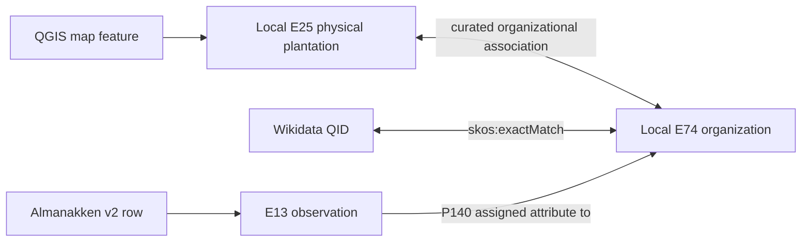

# CSV-to-model audit

This audit records the current executable mappings. The Almanakken portion is
based only on dataset v2.0; counts are produced by
`pnpm --dir app validate-almanakken-v2`.

## QGIS physical-place input

| Source value | Model target | Boundary |
| --- | --- | --- |
| `fid` | Stable source locator and E42 identifier | Not a cross-dataset identity |
| WKT geometry | E53/GeoSPARQL geometry | Extent at the map's stated date |
| Map labels | Source-carried E41 appellations | Identify the mapped E25 feature |
| `qid` | E25-E74 correspondence | Close match only for E25; exact match belongs on E74 |
| PSUR IDs | Cross-dataset identifiers | Research hints, never `owl:sameAs` |

## Almanakken v2 input

**File:** `Plantations Surinaamse Almanakken v2.0 (1).csv`

**Rows:** 22,482

**Columns:** 68

**Encoding/delimiter:** UTF-8 with BOM; semicolon

| v2 field group | Coverage or constraint | Model target |
| --- | --- | --- |
| `recordid` | 22,482 unique, non-empty | E13 observation URI suffix and provenance row |
| `year`, `page` | Source coordinates | E52 time-span value and page reference |
| `plantation_id` | 22,468 rows; 14 unlinked | Local E74 target matching key |
| `plantation_org`, `plantation_std`, `sranantongo_naam` | Source and standardized forms | Source-carried E41 appellations |
| `psur_id`, `psur_id2` | Optional cross-links | Provenanced identifiers, not identity replacement |
| `has_parts1_*` through `has_parts4_*`, `part_of_*` | Optional structural evidence | Retained on the annual observation pending event reconciliation |
| `owned_by_id`, `owned_by_id2`, `owned_by_lab` | Optional organization references | Retained as source-qualified ownership evidence |
| `product_std`, `deserted`, `size_std` | Time-varying values | E13 values and derived E13/E17 projections |
| management columns | Unstandardized transcriptions | Observation values; no automatic person identity |
| population columns | Time-varying counts | Observation dimensions with source provenance |

## Cross-dataset link

This correspondence does not assert `P52 has current owner`. Physical
ownership, residence, work, and coercive relationships require separate,
source-qualified assertions.

## Validation result

The importer rejects a changed header and has no legacy aliases or fallback
file. The migration audit also compares the complete editorial projection of
the Gazetteer before and after migration. Only Almanakken observations,
Almanakken-derived product/status assertions, and the Almanakken source tag may
change.
