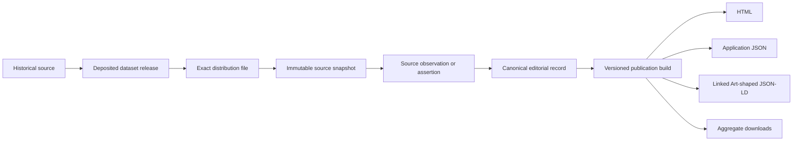

# Editorial and publication data architecture

**Status:** proposed migration direction
**Inventory baseline:** 2026-07-27

## Outcome

The current repository has a useful place Gazetteer, source registry, vocabulary
and source-qualified assertions. It is not yet a complete space–time–source
system because the evidence chain does not consistently reach an exact deposited
dataset release and file, and the latest-editor fields do not preserve a full
edit history.

The migration should keep three concerns separate:

1. immutable source deposits and source-derived snapshots;
2. concise canonical editorial records validated by the editor; and
3. generated public representations, including Linked Art-shaped JSON-LD.

The editor should not write deeply nested publication JSON-LD directly. It
should save a smaller validated editorial model, after which a deterministic
build produces HTML, application JSON, aggregate downloads, and semantic
JSON-LD. Linked Art defines a public retrieval model; management and editing
workflows are intentionally system-specific.

The first implementation in this proposal is the reproducible
[current-data inventory](../data-dictionary/README.md). No production data is
migrated by this document.

## Current evidence

The generated inventory covers all 16 JSON-based tables under `data/` plus the
merged temporal plantation-composition projection.

| Capability | Current evidence | Gap |
| --- | --- | --- |
| Space | 13 tables have explicit geometry or spatial fields. | Some dates and map identities exist only in filenames or surrounding documentation. |
| Time | 5 tables have explicit temporal fields. | Source snapshots do not carry a machine-readable coverage period or source-release link. |
| Historical source | The Gazetteer contains source IDs, source rows and dated assertions; the source registry describes maps and collections. | A source ID often resolves to a work or collection, not an exact deposited release and distribution file. |
| Editorial provenance | The Gazetteer and organization overrides can record latest editor/time or review state. | Latest-state fields overwrite history; no append-only semantic change event exists. |
| Dataset publication | Documentation mentions Dataverse/DOI deposits. | None of the current JSON tables records release version, exact file ID, checksum, retrieval time and license together. |
| Vocabulary | One JSON-LD SKOS graph contains 45 scheme/concept records with labels, definitions and mappings. | Public concepts are not yet separately retrievable as Linked Art-shaped objects and do not have complete change/source provenance. |

## Structural review after temporal compositions

The temporal-composition work is a useful, evidence-preserving projection, but
it also demonstrates why the current files should not be treated as one
coherent canonical model.

### What is stored where

| Layer | Current location | Current responsibility |
| --- | --- | --- |
| Raw evidence | `data/06-almanakken.../*.csv` | 22,482 immutable Almanakken rows and their source columns. |
| Editor aggregate | `data/places-gazetteer.jsonld` | Place authority state plus names, geometry, assertions and 19,483 materialized Almanakken observations. |
| Organization review | `data/organization-authority-overrides.jsonld` | Latest reviewed E74-to-E25 association choices without a temporal interval. |
| Aggregate publication | generated `app/lod/database.jsonld` | Full CSV-derived E13 observations, E74 organizations and 202 composition periods. |
| Per-place publication | generated `app/public/data/place-records/*` | Local projections of evidence attached to one place authority record. |
| Application index | generated `organization-composition-periods.json` | The same period indexed under every participating organization for UI lookup. |

The aggregate publication is generated from all 22,482 CSV rows. The editor
Gazetteer contains 19,483 unique materialized rows across 975 place records.
Consequently, only 198 of the 202 published composition periods can be
reconstructed from the editor JSON. The four missing periods all describe the
same composite organization, Q20967226, which is present in the source-derived
organization graph but not attached through the Gazetteer's physical-place
materialization.

This is a split source of truth:

- the aggregate can publish organization history that the place editor cannot
  inspect or correct;
- a change to the Gazetteer does not necessarily represent all source rows used
  by publication; and
- a JSON-only audit cannot reproduce the public graph.

The correct response is not to copy every CSV row into every place record. Raw
observations should be canonical source entities, while places and
organizations link to them. The editor can then review any organization
assertion even when no E25 physical place has been reconciled yet.

### Temporal composition: what is sound

The merged implementation:

- derives 202 organization-level composition periods from exact Almanakken
  `recordid` observations;
- requires one composite E74 and at least two distinct component E74
  organizations;
- groups only identical compositions in consecutive observed years;
- breaks a period when a year is missing;
- records every observation year and evidence URI;
- records source URIs, a deterministic inference rule and `probable`
  certainty;
- does not infer an E81 physical transformation, merger date or dissolution
  date; and
- uses local fragment identities for per-place projections so they do not
  redefine the canonical aggregate period with different evidence URIs.

Using `has_parts` as active composition evidence is conservative and supported
by the current source. `part_of` also occurs on separate-plantation rows before
and after a combined period, so treating every `part_of` value as evidence that
the combination was active would produce false temporal claims.

### Temporal composition: what remains inadequate

| Severity | Problem | Required direction |
| --- | --- | --- |
| Critical | The 202 composition periods relate E74 organizations but contain no E25 physical-place or geometry assertion. They are temporal, not spatio-temporal. | Add independently time-scoped organization-to-physical-place associations, then join to time-scoped geometry assertions. |
| Critical | The editor aggregate cannot reconstruct four published periods and offers no organization-level review workflow for them. | Make source observations addressable independently of the Gazetteer and expose organization assertions in the editor. |
| High | `organization-authority-overrides.jsonld` stores current E74-to-E25 choices as timeless arrays. | Replace or supplement them with association assertions carrying interval, source, certainty and review provenance. |
| High | Composition periods are generated summaries with no accept, reject, correct or supersede record. | Add an editorial decision/override entity while retaining the generated candidate and its evidence. |
| High | Source links stop at generated annual almanac entities or the generic registry entry. | Connect each observation to the exact deposited dataset release and distribution checksum. |
| Medium | A period URI is derived from participants and first attested year. Backfilling an earlier observation can still change it. | Persist accepted assertion IDs independently of mutable interval boundaries. |
| Medium | 83 Almanakken rows report only one `has_parts` organization and are conservatively excluded without a dedicated review output. | Publish them as incomplete composition candidates with an explicit exclusion reason. |
| Medium | The Gazetteer combines authority state, source-row copies, derived summaries, UI fields and latest-edit metadata in one 9,138-record graph with 163 observed field paths. | Separate source observations, editorial assertions and generated projections behind compatibility loaders. |

PR #46 therefore makes time-based organization composition queryable, but it
does not yet make plantation history fully space–time–source queryable.

### Required spatio-temporal join

The target query path is:

```text
source observation
  -> organization composition assertion valid at time T
  -> organization-place association valid at time T
  -> E25 physical plantation
  -> geometry assertion valid at time T
  -> exact map/source file and dataset release
```

These are different assertions. A source-reported organizational composition
must never silently merge E25 identities or geometries. A physical
transformation or boundary change requires its own evidence and event model.

## Layered architecture



### 1. Source layer

Source artifacts and imported snapshots are immutable. Corrections create a new
release or transformation output; they do not rewrite the evidence that
supported an earlier interpretation.

The source registry should distinguish:

- the historical carrier or publication, such as a map sheet or almanac;
- the deposited dataset concept;
- one immutable dataset release;
- the exact file distribution used by STM; and
- the extraction/transformation activity that created a source observation.

Every dataset release needs these fields before it can be called reproducible:

| Field | Purpose |
| --- | --- |
| `datasetPersistentId` | DOI, Handle, or other persistent dataset identifier. |
| `datasetVersion` | Repository-issued release number or label. |
| `versionState` | For example `RELEASED`, `DRAFT`, or `DEACCESSIONED`. |
| `releaseTime` | Repository release timestamp. |
| `citation` | Repository-provided citation for this release. |
| `license` | URI and label for the applicable license or terms. |
| `landingPage` | Human-facing persistent release page. |
| `apiUrl` | Machine-facing metadata endpoint when available. |
| `filePersistentId` | Repository identifier of the exact file consumed. |
| `fileName` and `mediaType` | Distribution identity and format. |
| `checksumAlgorithm` and `checksumValue` | Byte-level verification of the file. |
| `retrievedAt` | When this exact distribution was obtained. |

Design example only; `example.org` identifiers must never be published as STM
identifiers:

```json
{
  "id": "https://example.org/dataset/almanakken/release/2",
  "type": "DatasetRelease",
  "datasetPersistentId": "doi:EXAMPLE",
  "datasetVersion": "2.0",
  "versionState": "RELEASED",
  "releaseTime": "2026-01-15T10:30:00Z",
  "citation": "Repository-provided citation",
  "license": {
    "id": "https://example.org/license",
    "label": "Repository-provided license"
  },
  "landingPage": "https://example.org/dataset/almanakken",
  "apiUrl": "https://example.org/api/dataset/almanakken/versions/2.0",
  "distributions": [
    {
      "filePersistentId": "EXAMPLE-FILE-ID",
      "fileName": "almanakken.csv",
      "mediaType": "text/csv",
      "checksumAlgorithm": "SHA-256",
      "checksumValue": "EXAMPLE-CHECKSUM",
      "retrievedAt": "2026-07-27T09:00:00Z"
    }
  ]
}
```

### 2. Editorial layer

This is the canonical input edited through the application. It should use one
validated record per place, vocabulary concept, source/release, assertion and
change event. Suggested storage boundaries are:

```text
editorial/
  place/{stable-id}.json
  vocabulary/place-type/{stable-id}.json
  source/{stable-id}.json
  dataset-release/{stable-id}.json
  assertion/{stable-id}.json
  change/{stable-id}.json
```

These are logical boundaries, not a premature choice of Git, database, or
object-store persistence. JSON Schema should define the editor contract before
storage is moved.

An assertion, rather than every entity or convenience label, is the unit that
must be space–time–source aware:

```json
{
  "id": "https://example.org/assertion/place-name-1",
  "type": "NameAssertion",
  "subject": "https://data.surinametijdmachine.org/place/stm-00705",
  "value": {
    "content": "Example source spelling",
    "language": "nl"
  },
  "spatialTarget": "https://data.surinametijdmachine.org/place/stm-00705",
  "validDuring": {
    "begin": "1885",
    "end": "1885",
    "status": "known"
  },
  "evidence": [
    {
      "sourceObservation": "https://example.org/observation/row-1",
      "datasetRelease": "https://example.org/dataset/release-1",
      "distributionFile": "https://example.org/distribution/file-1"
    }
  ],
  "certainty": "probable",
  "reviewStatus": "reviewed"
}
```

`known`, `unknown`, and `not-applicable` should be explicit dimension states.
The system must not invent dates or coordinates merely to satisfy a form. A
structural identifier can legitimately have no temporal scope; a historical
name or organization–place relation cannot silently omit whether its scope is
known or unknown.

### 3. Publication layer

`https://data.surinametijdmachine.org/` remains the canonical identifier base.
Object-storage URLs are distribution locations, not entity identifiers. The
existing place URI contract should remain stable through migration:

- `/place/{id}` for HTML;
- `/place/{id}.json` for the application projection; and
- `/place/{id}.jsonld` for the semantic projection.

The requested editor host is `editor.surinametimemachine.org`. Its exact
spelling must be confirmed before DNS and authentication cutover because it
differs from the current Dutch `surinametijdmachine.org` identifier domain.
The editor host should never become the canonical public entity base.

Every build should itself be a versioned publication activity containing:

- build ID and timestamp;
- Git commit or database revision;
- schema/profile and generator versions;
- all input dataset release and file IDs;
- checksums of generated artifacts; and
- validation results.

This creates a traceable chain from public claim to editorial decision,
transformation, exact source file, deposited release, and historical source.

## Complete edit history

`modifiedBy` and `modifiedAt` are useful display fields but only describe the
latest state. The target model needs append-only change events with:

- stable change ID;
- target record and assertion IDs;
- actor and timestamp;
- create, update, merge, split, deprecate, or restore action;
- before/after hash or JSON Patch;
- justification and certainty change;
- evidence added or removed;
- superseded change ID; and
- issue, pull request, commit, or publication-build link.

Git remains a transport and code audit trail. A semantic edit event must remain
queryable in the data even if persistence later moves away from Git.

Merges must not delete evidence. The surviving record points to each superseded
record, while historical assertions and change events preserve what was
believed, when, by whom, and on what evidence. Time-scoped organization–place
relations should be assertions, not timeless arrays.

## GLOBALISE and Linked Art alignment

The supplied GLOBALISE place example has a useful publication pattern:

- stable `id` and `type`;
- `_label` as a display convenience;
- `identified_by` for identifiers/names;
- a declarative place expression for coordinates;
- status/assertion wrappers for classification, similarity, appellation and
  topography; and
- `referred_to_by` links back to supporting material.

STM should adopt those principles without copying GLOBALISE identifiers or
replacing the existing distinction between a physical plantation feature
(CIDOC CRM E25) and its place (E53). The current public profile should be
extended deliberately and validated before claiming full Linked Art
conformance.

References:

- [supplied GLOBALISE place example](https://objectstore.surf.nl/87435b768620494e8e911c83d1997f24:globalise-data/objects/place/GLOB2_899.json)
- [GLOBALISE JSON-LD context](https://objectstore.surf.nl/87435b768620494e8e911c83d1997f24:globalise-data/contexts/globalise.json)
- [Linked Art model](https://linked.art/model/)
- [Linked Art API](https://linked.art/api/1.0/)
- [Linked Art concept pattern](https://linked.art/model/concept/)

The supplied individual GLOBALISE thesaurus URL returned HTTP 403 during this
review, and the parent path did not provide a public index. Consequently this
proposal does not claim an exact field-by-field comparison with that object.

## Vocabulary direction

The current SKOS graph should remain available as an aggregate download during
migration. The public object model should additionally provide one retrievable
object per concept:

- `type: Type`;
- stable identifier and `_label`;
- multilingual names in `identified_by`;
- definition and scope/editorial notes in `referred_to_by`;
- broader and equivalent concepts;
- source evidence for imported or reconciled meanings; and
- editorial status plus append-only change provenance.

Interface-only fields such as color and sort order belong in an explicit STM
application profile. They should not be disguised as Linked Art core semantics.
Existing concept identifiers remain stable even if storage filenames change.

## Migration sequence

1. **Inventory (this change).** Keep one generated CSV dictionary per current
   JSON table and generated entity structure, and fail review on undocumented
   new paths.
2. **Dataset releases.** Extend the source registry with deposited release and
   exact distribution-file entities; validate identifiers and checksums.
3. **Editor contracts.** Define JSON Schemas for places, concepts, sources,
   assertions and changes; validate all saves at the API boundary.
4. **Edit events.** Append semantic change records while retaining
   `modifiedBy`/`modifiedAt` as derived convenience fields.
5. **Temporal associations.** Add reviewed, time-scoped E74-to-E25 association
   assertions and geometry assertions; expose incomplete composition evidence
   for review.
6. **Per-object editorial storage.** Split aggregates behind a compatibility
   loader without changing canonical public IDs.
7. **Semantic projection.** Generate Linked Art-shaped place and vocabulary
   objects alongside the current profile; add fixture and SHACL/profile checks.
8. **Versioned publication.** Publish build manifests and immutable object-store
   snapshots whose checksums link back to the build.
9. **Editor cutover.** Move editing to the selected editor host, preserve GitHub
   OAuth callback correctness, and keep `data.surinametijdmachine.org` public.

Each phase must be reversible and must preserve old identifiers and evidence.

## Decisions required before implementation

1. Confirm the exact editor hostname and spelling.
2. Choose the canonical editorial persistence backend: Git, database, or
   database plus immutable object snapshots.
3. Choose the Dataverse/repository API as the source of truth for release and
   file metadata.
4. Define the STM extension namespace and supported Linked Art profile.
5. Decide which statement types require first-class assertion records.
6. Define retention and access rules for editor identities and sensitive change
   history.
7. Decide whether raw source observations are served from the editor database,
   immutable object storage, or a generated source-record service.
8. Define the temporal semantics and review workflow for E74-to-E25
   organization-place associations.
