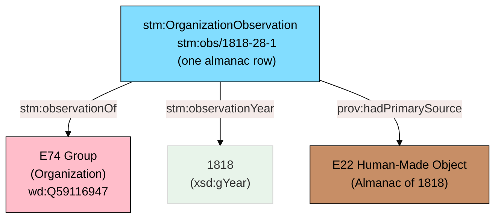
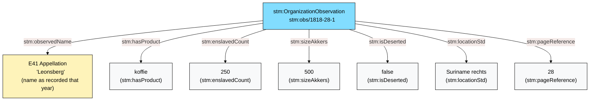
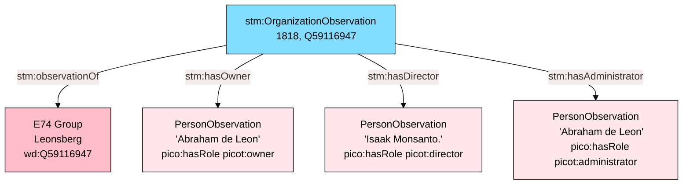
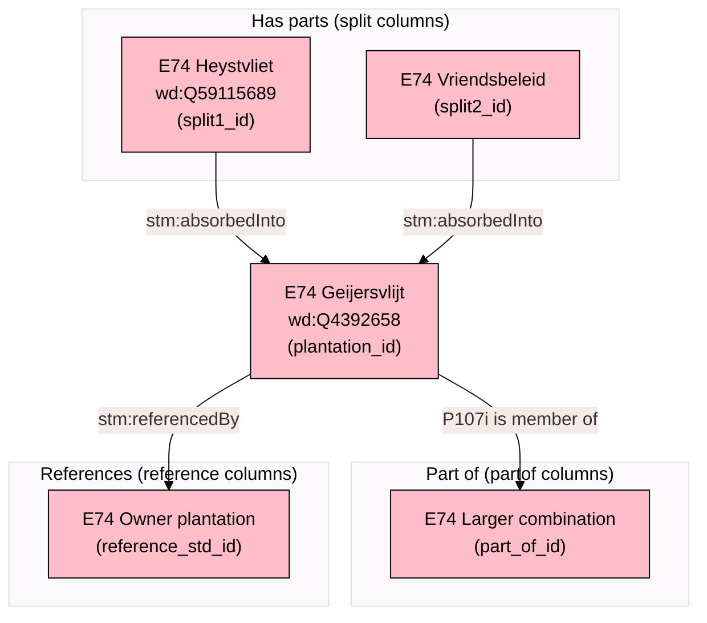
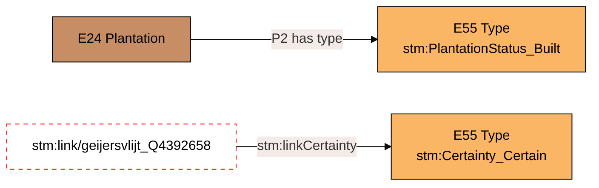
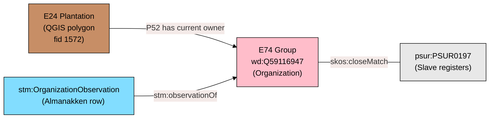
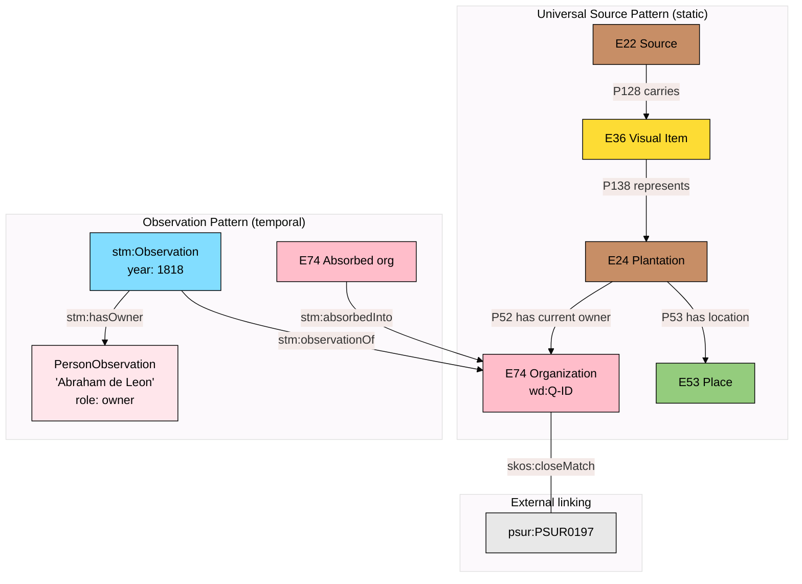

# Observations, People, and Temporal Change, Explained

The [universal source pattern](source-pattern-explained.mdx) describes how sources connect to real-world things. But everything in that pattern is _static_ --- it tells us what a map depicts, not how the plantation changed over 120 years of almanac records. This document explains the patterns that handle _time-varying data_: observations, people, mergers, and the structural relationships between plantations.

---

## The Problem: 23,000 Rows of Change

The Almanakken CSV contains 23,003 rows. Each row is an annual snapshot of a plantation organization: who owned it, who managed it, how many enslaved people were recorded, what it produced, whether it was deserted. The same organization (`wd:Q4392658`, Geijersvlijt) appears in row after row, year after year, with different values.

If we modeled each fact as a permanent property of the E74 organization, we would have contradictions. Geijersvlijt had 250 enslaved people in 1818 and 0 in 1920. It produced coffee in 1818 and nothing in 1920. These are not errors --- they are observations at different points in time.

CIDOC-CRM solves this with _events_. But the Almanakken are not describing events (nobody is recording "the moment ownership transferred"). They are annual _observations_ --- a clerk looked at a plantation and wrote down what they saw that year.

---

## Layer 8 --- The Observation Pattern

**Entities:** OrganizationObservation (custom `stm:` class)
**Relationships:**

- `Observation --stm:observationOf--> E74 Group`
- `Observation --stm:observationYear--> year`



### Why a custom class instead of CIDOC-CRM events?

CIDOC-CRM's E13 Attribute Assignment could technically model this --- each observation is an act of assigning an attribute. But E13 is heavy: it requires documenting who made the assertion, when, and with what authority. For 23,000 rows of almanac data that all follow the same pattern (a clerk copied numbers from a ledger into a book), the overhead is not justified.

Instead, we use `stm:OrganizationObservation` --- a lightweight observation entity that:

- Points to the E74 it observes (via `stm:observationOf`)
- Records the year (via `stm:observationYear`)
- Carries all the time-varying properties from that row
- Links back to the source (via `prov:hadPrimarySource`)

This is a pragmatic design choice. If we later need E13-level provenance for specific observations (e.g., a disputed ownership claim), we can promote individual observations to full E13 instances. But for the bulk of the data, the lightweight pattern is sufficient.

### What the observation carries

Each observation holds the properties that change year by year:



The name recorded in the observation (`stm:observedName`) is itself an E41 Appellation --- a name as it appeared in that specific year's almanac. This preserves spelling variations across years.

---

## Layer 9 --- People: The PICO Pattern

**Entities:** PersonObservation (PICO model)
**Relationships:**

- `Observation --stm:hasOwner--> PersonObservation`
- `Observation --stm:hasAdministrator--> PersonObservation`
- `Observation --stm:hasDirector--> PersonObservation`
- `PersonObservation --pico:hasRole--> Role`



### Why PICO?

The PICO (Person In Context Ontology) model separates the _observation_ of a person from the _reconstruction_ of their identity. This matters enormously for historical data:

- The 1818 almanac says the owner of Leonsberg is "Abraham de Leon."
- The 1820 almanac says the owner of Leonsberg is "Abr. de Leon."
- The 1825 almanac says the owner of Leonsberg is "A. de Leon."

Are these the same person? Almost certainly. But the almanac clerks did not use persistent identifiers. They wrote down names with varying abbreviations and spellings.

PICO handles this in two layers:

1. **PersonObservation** --- the raw data. "Abraham de Leon" as owner of Leonsberg in 1818. This is a fact about the source, not a claim about identity.

2. **PersonReconstruction** --- the scholarly conclusion. "These three observations all refer to the historical person Abraham de Leon (born ~1770, died ~1830)." This is an interpretation that can be revised.

We currently create only PersonObservations. PersonReconstructions are future work that requires name normalization (already underway according to domain expert notes).

### The three roles

The Almanakken distinguish three types of personnel:

| Almanac Column    | Role                | CRM Relationship         | Meaning                                                                                      |
| ----------------- | ------------------- | ------------------------ | -------------------------------------------------------------------------------------------- |
| `eigenaren`       | picot:owner         | P52i is current owner of | Legal owner of the plantation. Could be a person or an institution (bank, estate).           |
| `administrateurs` | picot:administrator | P107 member of E74       | Managed the plantation from a distance (Paramaribo or Europe). Business/financial oversight. |
| `directeuren`     | picot:director      | P107 member of E74       | On-site plantation manager. Physically present. Day-to-day operations.                       |

Later almanac editions (post-1835) additionally distinguish:

- `administrateurs_in_Europa` --- administrators based in the Netherlands
- `administrateurs_in_Suriname` --- administrators based in Paramaribo
- `blankofficier` --- overseers, ranked below the director (only 1835 edition)

These additional columns create more specific PersonObservations with the same pattern, just with more granular roles.

### Multiple names in one field

A single `eigenaren` field may contain: `"J.H. Franke, E.G. Veldwijk en de Curators deze Kolonie."` --- that is three owners in one cell. The transformation scripts need to parse these into separate PersonObservation instances. This parsing is an interpretation step and should be documented.

---

## Layer 10 --- Mergers, Splits, and Structural Relationships

**Relationships:**

- `E74 --stm:absorbedInto--> E74` (organization absorbed by another)
- `E24 --stm:mergedInto--> E24` (physical plantation merged)
- `E74 --P107i is member of--> E74` (part-of relationship)
- `E74 --stm:referencedBy--> E74` (inter-plantation reference)



### Mergers: stm:absorbedInto

Surinamese plantation history is full of mergers. Small coffee plantations were absorbed by larger sugar plantations as the coffee economy declined. The Almanakken track this through the `split` columns:

- `split1_lab` / `split1_id` through `split5_lab` / `split5_id` --- these are plantations that have been **merged into** the current plantation. The naming is confusing (they are called "split" in the CSV but represent the opposite: components that were _absorbed_).

When `split1_id = Q59115689` on the row for `plantation_id = Q4392658`, it means:

```
E74 Q59115689 (Heystvliet) --stm:absorbedInto--> E74 Q4392658 (Geijersvlijt)
```

The absorbed organization's Q-ID still exists in Wikidata but is marked as having been absorbed. This matters for PSUR linking --- a PSUR ID might reference the absorbed plantation, not the surviving one. Without tracking the absorption, that link would break.

On the QGIS side, the `qid_alt` column captures the same phenomenon: a polygon has a primary Q-ID (`qid`) and an alternative Q-ID (`qid_alt`) for the absorbed entity:

```
E24 polygon --P52 has current owner--> E74 (qid, surviving org)
E24 polygon --P51 has former or current owner--> E74 (qid_alt, absorbed org)
E74 (qid_alt) --stm:absorbedInto--> E74 (qid)
```

### Part-of: P107i is member of

Some plantations are part of larger merged combinations. The `partof_lab` / `part_of_id` columns record this:

```
E74 (plantation_id) --P107i is member of--> E74 (part_of_id)
```

We use CIDOC-CRM's standard `P107 has current or former member` (inverse: `P107i is current or former member of`) because this is organizational membership --- one E74 group belongs to a larger E74 group around. This is standard CRM for nested organizations.

### References: stm:referencedBy

Some almanac entries say "see Plantation X" or indicate that plantation A is owned by or related to plantation B. The `reference_std_id` / `reference_std_lab` columns capture this:

```
E74 (plantation_id) --stm:referencedBy--> E74 (reference_std_id)
```

This is a weaker link than absorption or membership --- it indicates a reference relationship that may be ownership, administrative connection, or simply that the almanac clerk pointed researchers to another entry for more information. The reference network is valuable for linking when direct PSUR matches fail: if plantation A references plantation B, and B has a PSUR ID, we may be able to trace A through B.

---

## Layer 11 --- Types and Certainty

**Entities:** E55 Type
**Relationships:**

- `E24 --P2 has type--> E55 PlantationStatus`
- `stm:link --stm:linkCertainty--> E55 Certainty`



### PlantationStatus

Not every polygon on the 1930 map was an active plantation. Some were planned but never built. Some were abandoned ruins. E55 Type gives us a controlled vocabulary:

| Status                           | Meaning                             | How determined                                                 |
| -------------------------------- | ----------------------------------- | -------------------------------------------------------------- |
| `stm:PlantationStatus_Built`     | Physically constructed and operated | Has almanac records, appears on maps with structures           |
| `stm:PlantationStatus_Planned`   | Plan only, never built              | Appears on maps but no almanac records, no operational data    |
| `stm:PlantationStatus_Abandoned` | Ceased operations                   | Almanac says "verlaten" (deserted), or no entries after a date |
| `stm:PlantationStatus_Unknown`   | Cannot determine                    | Insufficient evidence                                          |

The `deserted` column in the Almanakken (2,294 rows with values) provides direct evidence for abandonment. But a plantation can be abandoned and then reactivated --- so the status is also time-dependent and ideally lives on the observation, not just on E24.

### Link Certainty

When connecting an E24 Plantation (from QGIS) to an E74 Organization (via Q-ID), the match may be uncertain. Qualified links capture this:

```
stm:link/geijersvlijt_Q4392658
    stm:plantation  stm:plantation/geijersvlijt
    stm:organization  wd:Q4392658
    stm:linkCertainty  stm:Certainty_Certain
    stm:linkEvidence  "Exact name match on 1930 map and Wikidata label"
```

Three levels:

- **Certain** --- exact name match, confirmed by multiple sources
- **Probable** --- strong name similarity, plausible location
- **Uncertain** --- tentative, needs verification

This is particularly important for the 536 QGIS polygons that have no Q-ID. Future linking work will need to assess and record certainty for each match.

---

## Layer 12 --- Cross-Dataset Linking via PSUR

**Relationship:** `E74 --skos:closeMatch--> psur:{ID}`



### Why skos:closeMatch and not owl:sameAs?

PSUR IDs were created by modern researchers to link the slave registers to plantations. They are not historical identifiers. The matching has known flaws:

- Some PSUR IDs are incorrectly assigned
- Some plantations lack IDs entirely
- Mergers/splits create ambiguity about which component plantation a PSUR ID refers to
- A PSUR ID might link to a component plantation that was later absorbed into a larger one

`skos:closeMatch` says: "these two concepts are sufficiently similar that they can be used interchangeably in _some_ information retrieval applications." That is exactly the right claim. `owl:sameAs` would say they are identical --- which they are not. `skos:exactMatch` would be too strong given the known errors.

### The PSUR complexity with mergers

Consider this scenario:

- PSUR0118 was assigned to the plantation "Geijersvlijt" in the slave registers
- But by 1930, Geijersvlijt had absorbed "Kl. Suzanna'sdal" (Q131349015)
- The QGIS polygon for Geijersvlijt also carries `psur_id2` for the absorbed plantation

Without the merger network (Layer 10), you cannot know that PSUR0118 connects through an absorption chain. The `skos:closeMatch` on E74, combined with `stm:absorbedInto`, gives us the full picture:

```
E74 Q4392658 (Geijersvlijt) --skos:closeMatch--> psur:PSUR0118
E74 Q131349015 (Kl. Suzanna'sdal) --stm:absorbedInto--> E74 Q4392658
E74 Q131349015 --skos:closeMatch--> psur:PSUR02xx (if assigned)
```

---

## How It All Connects

The observation pattern sits _on top of_ the universal source pattern. The source pattern gives us the static structure (sources, things, names, locations). The observation pattern gives us the temporal dimension (annual snapshots, changing properties, people, mergers).



The E74 Organization is the meeting point. Everything connects through it:

- The plantation (E24) is owned by it (P52)
- The observations describe it (stm:observationOf)
- The people relate to it (via observation roles)
- The PSUR links identify it (skos:closeMatch)
- Absorbed organizations merge into it (stm:absorbedInto)
- The Q-ID is its permanent identifier, shared across datasets
